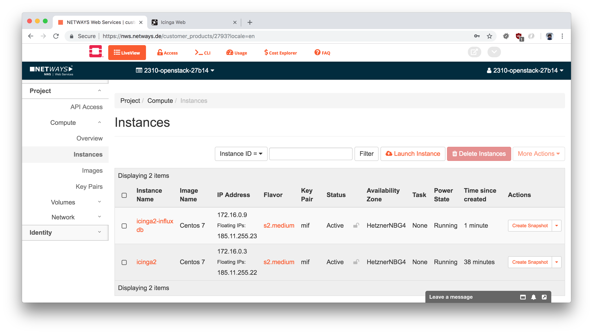
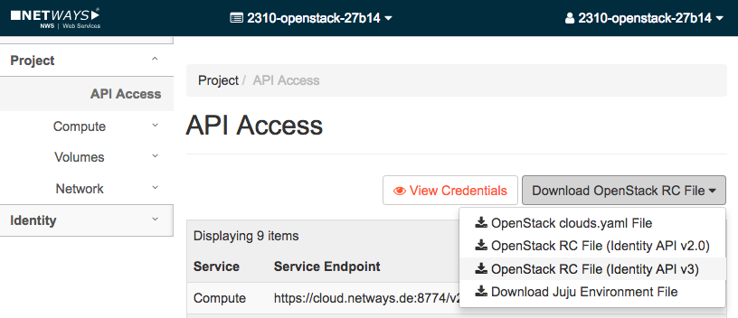
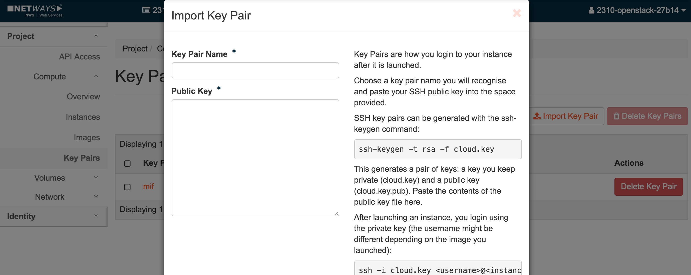
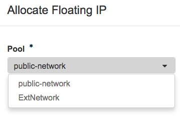

# Icinga Vagrant in OpenStack

You'll need to have access to your OpenStack cloud platform and
a ready to use local Vagrant installation.

This documentation does not cover the OpenStack basics, just the
required fields for an OpenStack "vagrant up" run.

> **Note**
>
> The Vagrant boxes have been tested with the [NWS OpenStack](https://nws.netways.de/products/openstack?locale=en)
> cloud platform.



## Requirements

### Environment: openrc

Open the OpenStack webinterface and navigate to `API Access`.
Download the `OpenStack RC File (Identity API v3)` file.



Open a terminal if not already opened, and source the downloaded openrc file.
Paste/type the account password when asked.

```
source openstack-openrc.sh

<enter password>
```

### Key Pair

Open the OpenStack webinterface and navigate to `API Access > Compute > Key Pairs`.



Import a key pair, for demo cases use your own public SSH key.

Note the private key path. Note the name of the key pair.

Extract the default username from the image, for CentOS 7 that's just "centos".

```
export OS_SSH_PRIVATE_KEY_PATH="~/.ssh/id_rsa"
export OS_KEYPAIR_NAME="mif"
export OS_SSH_USER="centos"
```

### Flavor

Pick a flavor depending on your OpenStack installation. For NWS OpenStack, I'm choosing `s2.medium`.

```
export OS_FLAVOR=s2.medium
```

### Image

Use the CentOS 7 image. **Other distributions are not supported.**

```
export OS_IMAGE="Centos 7"
```

### Network

Specify the default pool for floating ips. Navigate to `Network > Floating IPs` and get the proper name.




```
export OS_FLOATING_IP_POOL="public-network"
```

Note: Vagrant automatically detects the IP address from the specified floating IP pool
and uses it for Puppet/Hiera provisioning for external services (HTTP, Icinga, integrations).

```
    icinga2: OpenStack SSH IP address detected: 185.11.255.22 for hostname icinga2.novalocal
    icinga2: Patching Hiera for Puppet provisioner in /hieradata/node/icinga2.novalocal.yaml.
```

### Security Groups

Navigate to `Network > Security Groups` and add a new group called `vagrant`.


Depending on the Vagrant box, you'd need the following opened ports:

* 22, 80, 443 as default
* 5665 for Icinga 2 cluster communication
* 8003 for Graphite Web
* 8004 for Grafana
* 8005 for Dashing
* 2003 for Graphite/Carbon
* 8086 for InfluxDB
* 9200 for Elasticsearch
* 9000 for Graylog

## Installation

Install the OpenStack Vagrant plugin.

```
vagrant plugin install vagrant-openstack-provider
```

## Run

```
vagrant up --provider=openstack
```

If you made a mistake e.g. with wrong floating ip pool names, or anything different,
just destroy the box and start over again.

```
vagrant destroy -f
vagrant up --provider=openstack
```

### Complete Example

```
source openstack-openrc.sh

export OS_SSH_USER="centos"
export OS_SSH_PRIVATE_KEY_PATH="~/.ssh/id_rsa"
export OS_KEYPAIR_NAME="mif"

export OS_FLAVOR=s2.medium
export OS_IMAGE="Centos 7"
export OS_INTERFACE="public-network"

export VAGRANT_OPENSTACK_LOG=debug
vagrant up --provider=openstack
```

### Troubleshooting

The plugin allows to activate the debug logging which provides insights into every
OpenStack REST API call and more.

```
export VAGRANT_OPENSTACK_LOG=debug
vagrant up --provider=openstack
```
